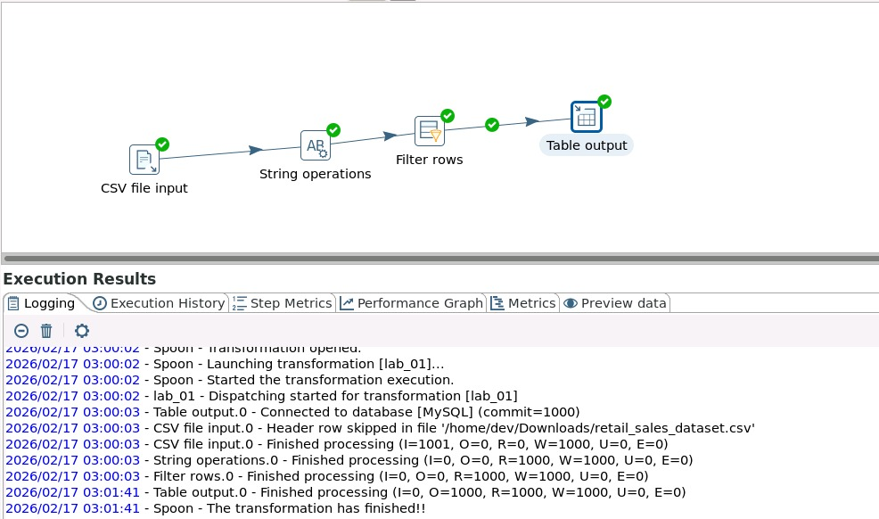
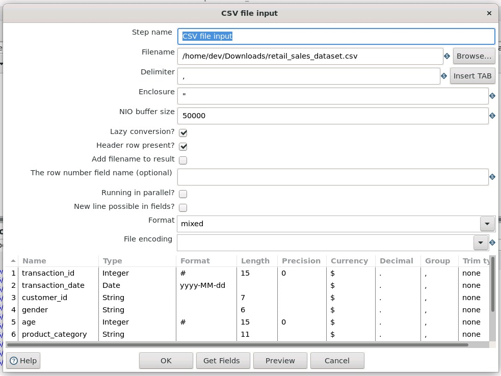
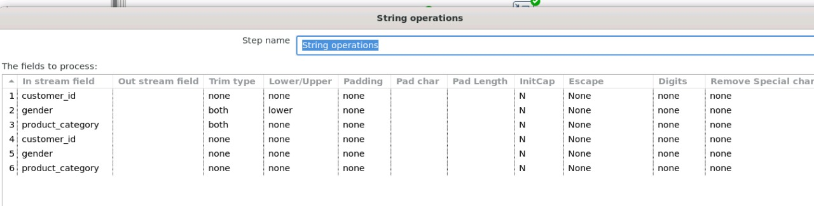
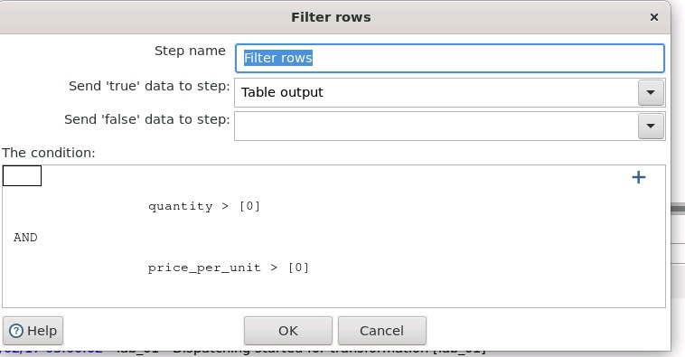
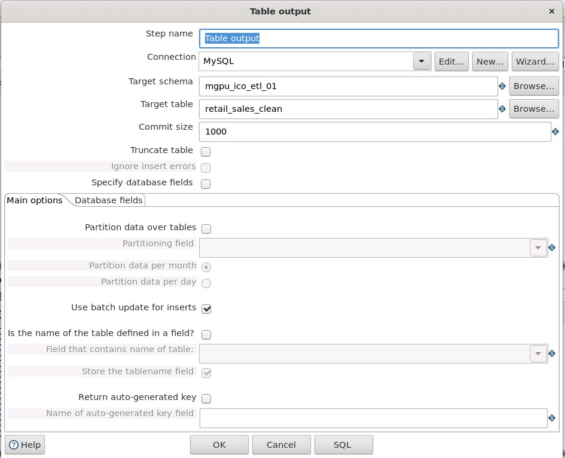

# ETL  
## Лабораторные работы  
### Вариант 1

---

## Лабораторная работа №1

### Задание
Анализ розничных продаж:
- фильтрация транзакций;
- выявление аномалий.

### Датасет
Retail Sales Dataset (Kaggle):  
https://www.kaggle.com/datasets/mohammadtalib786/retail-sales-dataset

### Описание входных данных

**Transaction ID** — уникальный идентификатор каждой транзакции, позволяющий отслеживать и ссылаться на неё.  

**Date** — дата совершения транзакции, используемая для анализа динамики продаж во времени.  

**Customer ID** — уникальный идентификатор клиента, позволяющий выполнять клиентский анализ.  

**Gender** — пол клиента (мужской / женский), используется для анализа покупательского поведения.  

**Age** — возраст клиента, применяется для сегментации и анализа возрастных факторов.  

**Product Category** — категория приобретённого продукта (например, электроника, одежда, косметика), помогает определить потребительские предпочтения.  

**Quantity** — количество единиц приобретённого продукта.  

**Price per Unit** — цена одной единицы продукта.  

**Total Amount** — общая сумма транзакции, отражающая финансовый объём покупки.

## 2. Конвейер ETL в Spoon

### Общий вид трансформации

### Ключевые шаги

**CSV Input** (чтение данных)  

**String Operations** (очистка данных: trim, lower case для пола)  

**Filter Rows** (фильтрация битых и аномальных записей)  
- Пропускаются только строки с:  
  - Quantity > 0  
  - Price per Unit > 0    

**Table Output** (загрузка в MySQL)    

---
