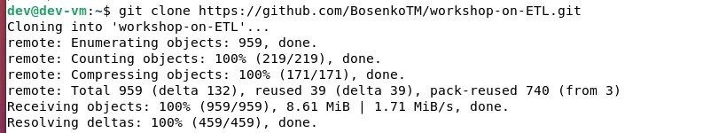
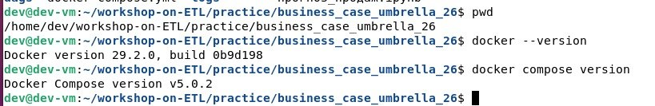
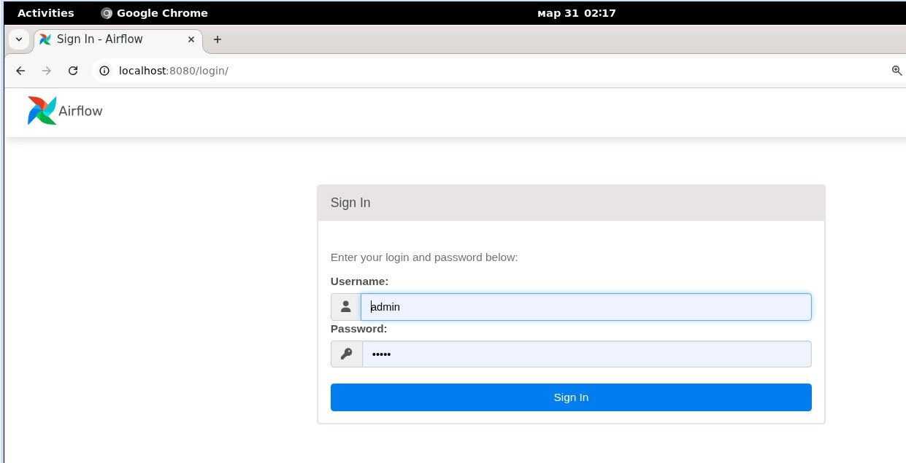
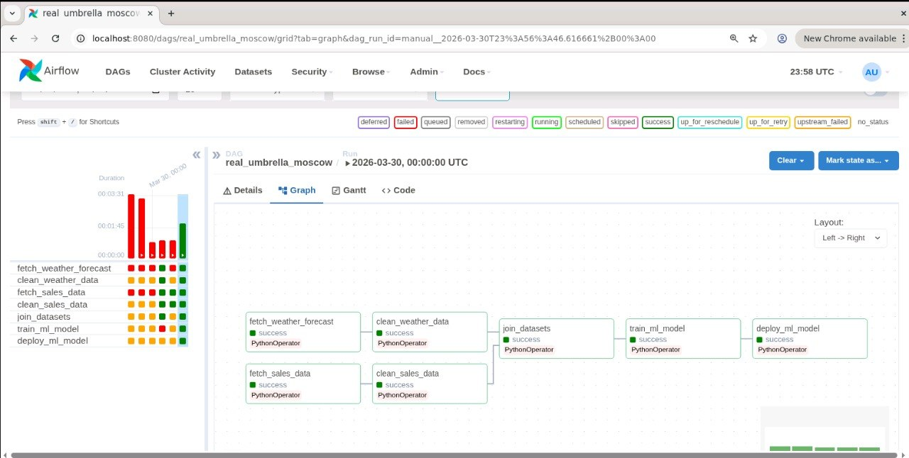
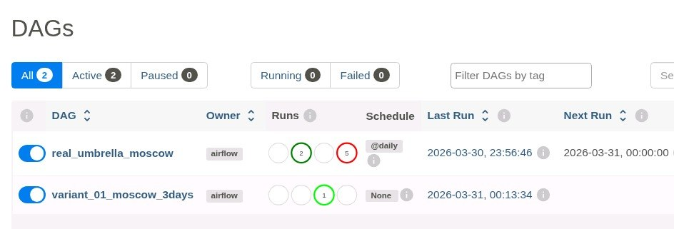
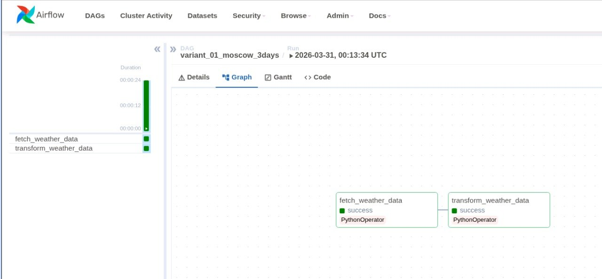
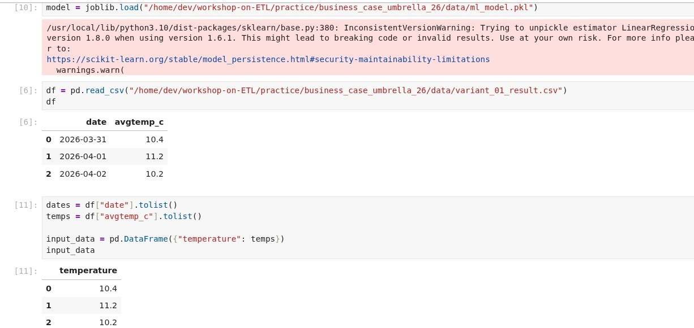
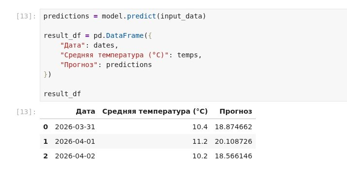
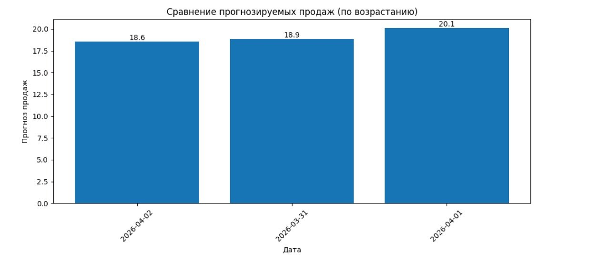
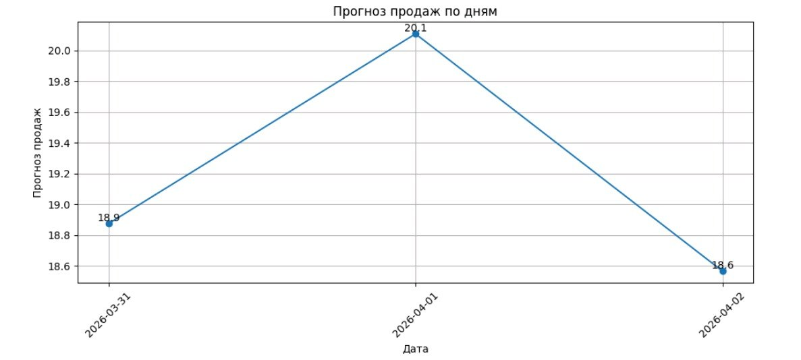

# Лабораторная работа 5.1

# Вариант 1.

## Проектирование объектной модели данных и ETL-конвейера

### Выполнил: Вознесенская Вероника Евгеньевна

### Группа: АДЭУ-221


---

# 1. Задание


# 2. Развертывание среды

В ходе работы была развернута виртуальная машина с Ubuntu.
Внутри ВМ был установлен и использован Docker.

Далее был клонирован репозиторий с материалами:



Затем был собран Docker-образ и запущены сервисы Airflow:



Веб-интерфейс Airflow был доступен по адресу:

```
http://localhost:8080
```




# 3. Изучение DAG

В системе Airflow был рассмотрен DAG `real_umbrella_moscow`.

В данном DAG реализованы следующие этапы:

1. Получение погодных данных (API)
2. Очистка погодных данных
3. Генерация и очистка данных о продажах
4. Объединение данных
5. Обучение ML-модели
6. Использование (деплой) модели





# 4. Архитектура решения

Архитектура решения состоит из трёх уровней:

### Source Layer

Источник данных — API погодных данных (Open-Meteo).

### Storage Layer

На этом уровне сохраняются:

* промежуточные CSV-файлы (weather, sales, joined данные);
* итоговые данные;
* модель машинного обучения (`ml_model.pkl`).

### Business Layer

На этом уровне данные используются:

* в Jupyter Notebook;
* для построения графиков;
* для аналитики и прогнозирования.


# 5. Индивидуальное задание

Был реализован пользовательский DAG:

```
variant_01_moscow_3days
```







Функциональность DAG:

* получение прогноза погоды для Москвы на 3 дня;
* выбор только нужных полей (`date`, `avgtemp_c`);
* сохранение результата в CSV-файл.


# 7. ML-анализ и прогнозирование

Обученная модель (`ml_model.pkl`) была использована в Jupyter Notebook.

Модель прогнозирует зависимость:

```
температура → продажи
```




Входные данные были загружены из CSV, сформированного ETL-конвейером, что исключает ручной ввод.

На основе температур был выполнен прогноз продаж.


# 8. Визуализация

Были построены графики:






# 9. Вывод

В ходе работы:

* была развернута система Apache Airflow;
* реализован ETL-конвейер обработки данных;
* спроектирована архитектура решения;
* выполнено обучение модели машинного обучения;
* проведено прогнозирование продаж на основе температуры.

Полученные результаты демонстрируют полный цикл работы с данными: от получения до аналитики и визуализации.


