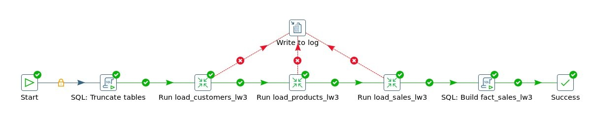
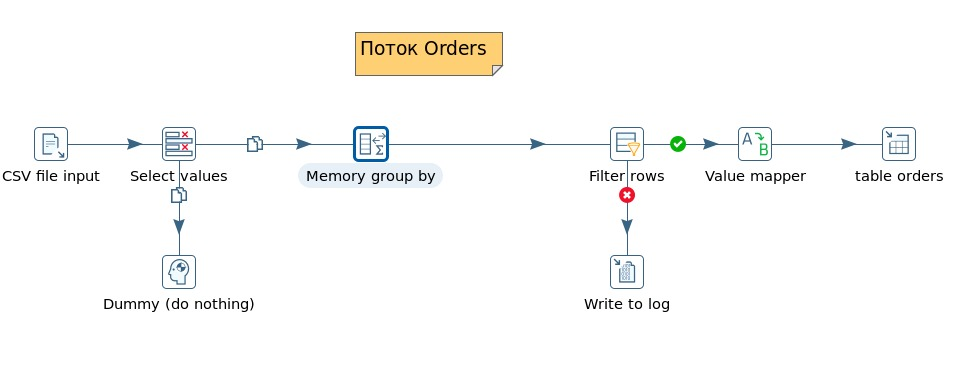
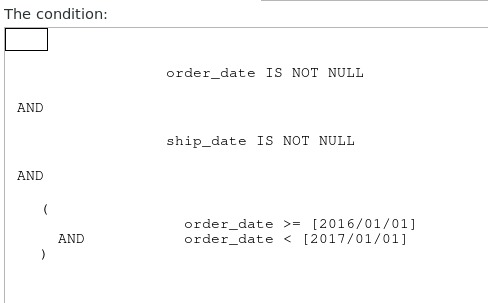
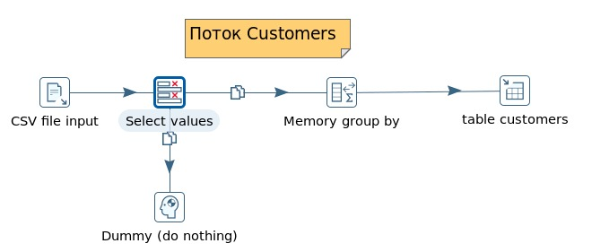
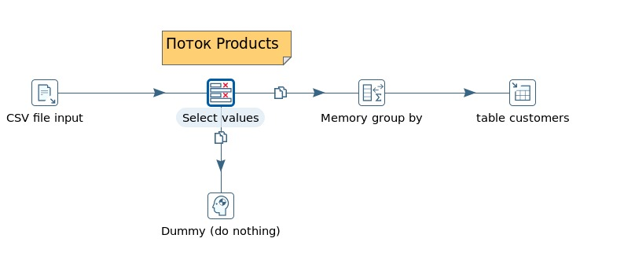
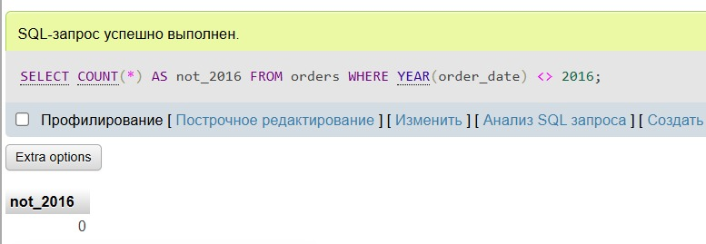
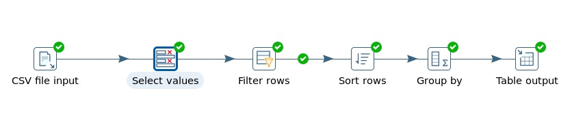
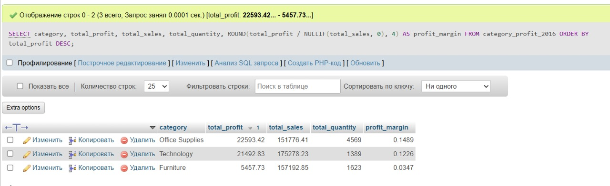
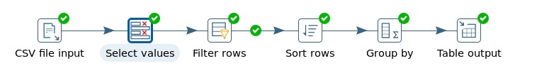
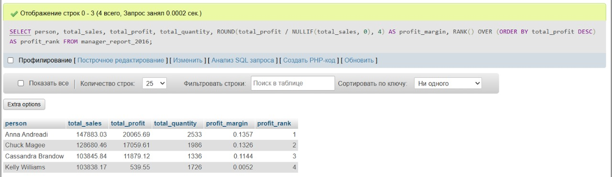

# Лабораторная работа 2
## Динамические соединения с базами данных (Pentaho PDI)

**Вариант №1**

| Основной фильтр для загрузки в БД | Доп. задание 1 (Аналитика) | Доп. задание 2 (Аналитика) |
|------|----------|----------|
| Заказы за 2016 год | Анализ прибыльности по категориям | Отчёт по менеджерам |

---

## Job

  
[Файл Job](Job_CSV_to_MYsql.kjb)

---

## Трансформации

### **Трансформация 1. Load Orders**

Общий вид  
  
[Файл трансформации](lb_02_1_orders.ktr)

Настройка фильтра:
- **Filter Rows**  

---

### **Трансформация 2 — Load Customers**

  
[Файл трансформации](lb_02_2_csv_to_Customers.ktr)

---

### **Трансформация 3 — Load Products**

  
[Файл трансформации](lb_02_3_csv_to_products.ktr)

---

## Проверка фильтра SQL

---

## Дополнительное задание 1 — Анализ прибыльности по категориям

Для выполнения аналитической задачи была разработана отдельная трансформация, формирующая агрегированную витрину данных по категориям товаров.

Файл трансформации:  
[analytics_profit_by_category.ktr](analytics_profit_by_category.ktr)

  

В рамках трансформации выполнялась:
- фильтрация данных за 2016 год  
- агрегация по категориям товаров  
- расчёт суммарных показателей (прибыль, продажи, количество)

Результаты были экспортированы в формат CSV и загружены в Google Colab для визуализации.

Графики и аналитические выводы представлены в ноутбуке:  
[Блокнот Google Colab](ETL_lw2.ipynb)

---

## Дополнительное задание 2 — Отчёт по менеджерам

Для анализа эффективности менеджеров была разработана отдельная трансформация, формирующая агрегированную таблицу по каждому менеджеру.

Файл трансформации:  
[report_by_managers.ktr](report_by_managers.ktr)

  

В трансформации выполнялась:
- фильтрация данных за 2016 год  
- агрегация по менеджерам (поле `Person`)  
- расчёт суммарных показателей (продажи, прибыль, количество)

Результаты были экспортированы в формат CSV и загружены в Google Colab для визуализации.

Графики и аналитические выводы представлены в ноутбуке:  
[Блокнот Google Colab](ETL_lw2.ipynb)
